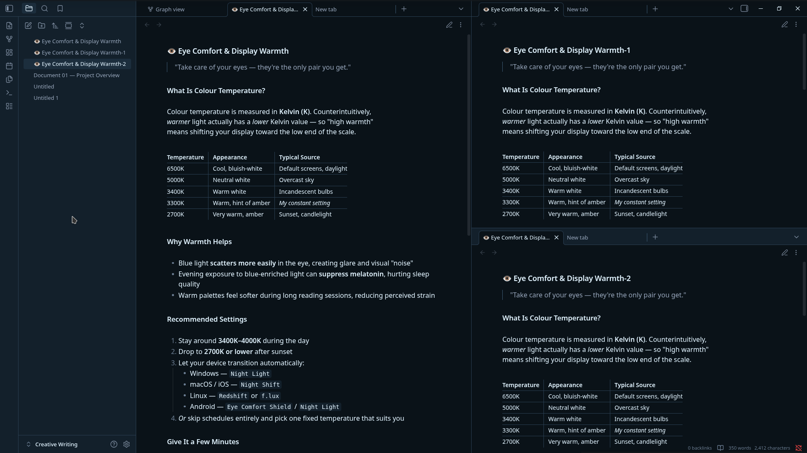
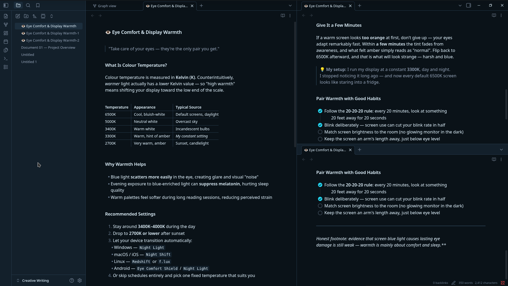
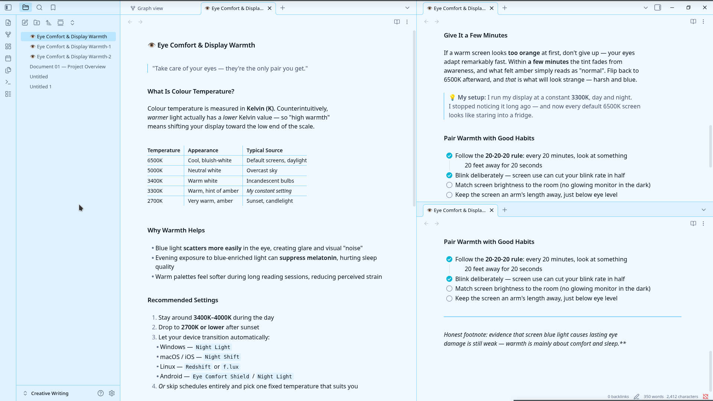
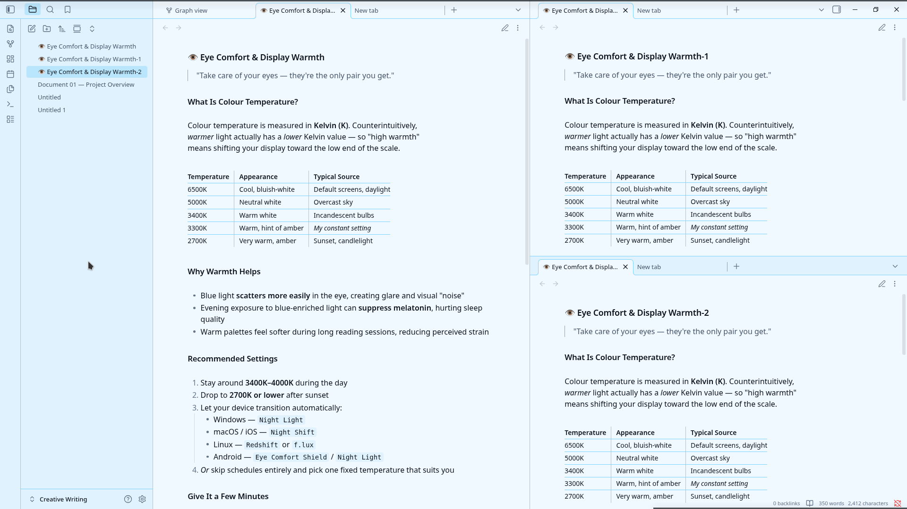

# Glacial Bloom

A dark, icy Obsidian theme built for focused deep work. Deep glacial blue-black backgrounds carry ice-white text, with a crystalline cyan accent and a signature warm red bloom for highlights — designed to feel like frost catching firelight.

Glacial Bloom is a recolour of [Minimal](https://github.com/kepano/obsidian-minimal) v9.0.2 by [@kepano](https://twitter.com/kepano). All credit for the theme architecture, feature set, plugin compatibility, and Style Settings surface goes to Steph Ango. This repo only changes the color values.

## Why Glacial Bloom?

Most dark themes default to pure black backgrounds with pure white text. After a few hours of deep work, that's harsh — and the standard yellow highlighter for marks feels aggressive against dark surfaces. Glacial Bloom takes a different approach:

- **Blue-black, not pure black** — backgrounds use `#0a1218` (deep glacial blue) instead of `#000000`. Less OLED smear, less harsh on the eyes, more "moonlit ice" than "void."
- **Ice-white text, not pure white** — body text uses `#e0f2fe` (cool ice white) instead of `#FFFFFF`. Same readability, softer contrast.
- **A single cyan accent** — crystalline cyan `#22d3ee` for links and interactive elements. Cool enough to read as light, not so saturated it shouts.
- **A signature warm red bloom** — text highlights use muted red `#dc2626` at 35% opacity, not yellow. The result feels like warm light bleeding into ice — a single warm note in a cold field.

The light variant (**Glacial Mist**) inverts the same palette: pale icy backgrounds with deep blue-black text, a darker cyan accent for contrast on bright surfaces, and the warm red bloom preserved.

## Screenshots

| Dark mode — editor | Light mode — editor |
|---|---|
|  |  |

| Dark mode — reading | Light mode — reading |
|---|---|
|  |  |

## Install

### From Obsidian (after community directory approval)

1. Open **Settings → Appearance → Themes → Manage**
2. Search for **"Glacial Bloom"**
3. Click **Install**, then **Use**
4. Toggle between dark and light via **Settings → Appearance → Base color scheme**

### Manual install

1. Download the [latest release](https://github.com/W-O-Debian/glacial-bloom/releases) `.zip`
2. Extract into your vault's `.obsidian/themes/Glacial Bloom/` directory
   - The folder name **must** be exactly `Glacial Bloom` (with a space) — it must match the `name` field in `manifest.json`
3. In Obsidian: **Settings → Appearance → Themes → Manage**, then select **Glacial Bloom**

### Companion plugins (recommended)

Glacial Bloom inherits Minimal's full feature set. For complete control over features like focus mode, table styles, tab styles, and color schemes, install:

- **[Minimal Theme Settings](https://github.com/kepano/obsidian-minimal-settings)** — adds a settings panel for all Minimal features
- **[Hider](https://github.com/kepano/obsidian-hider)** — hides UI elements for distraction-free writing
- **[Style Settings](https://github.com/mgmeyers/obsidian-style-settings)** — exposes Glacial Bloom's full Style Settings panel for granular color customization

## Palette

### Dark mode (default)

| Role | Hex | Use |
|---|---|---|
| Background | `#0a1218` | Editor canvas, primary surface — glacial blue-black |
| Card / Surface | `#13202b` | Sidebars, ribbon, modals |
| Popover / Hover | `#1c2e3d` | Hover states, active selection |
| Border | `#567b95` | Dividers, button borders |
| Foreground | `#e0f2fe` | Body text — ice white |
| Muted text | `#94a3b8` | Secondary text — slate |
| Accent | `#22d3ee` | Links, focus rings — crystalline cyan |
| Accent hover | `#67e8f9` | Hovered links — lighter cyan |
| Secondary accent | `#1e40af` | Royal blue — for elements needing weight |
| **Signature bloom** | `#dc2626` | Text highlights — warm red |

### Light mode (Glacial Mist)

| Role | Hex | Use |
|---|---|---|
| Background | `#f0f9ff` | Pale ice |
| Card / Surface | `#e0f2fe` | Lighter cyan surface |
| Popover / Hover | `#bae6fd` | Sky cyan |
| Border | `#7dd3fc` | Subtle border |
| Foreground | `#0a1218` | Deep glacial blue-black |
| Muted text | `#475569` | Slate |
| Accent | `#0891b2` | Darker cyan — for link contrast |
| Accent hover | `#0e7490` | Deeper cyan |
| **Signature bloom** | `#dc2626` | Warm red — preserved |

## What's included

Because Glacial Bloom is a Minimal recolour, you inherit the full Minimal feature set:

- **Focus mode** — auto-hides ribbon, tabs, status bar; reveals on hover
- **Cards** — Dataview tables and lists render as responsive card grids
- **Image grid** — adjacent images auto-arrange into a grid
- **Table helpers** — row/column lines, striped rows, row numbers, tabular figures, centered tables, and more
- **Tab styles** — default, square, underline, modern; sidebar variants
- **Callouts** — filled or outlined
- **Embeds** — strict, hide-title, underline
- **Heading dividers** — optional underline below H1–H6
- **Tag styles** — plain, bordered pill, rounded, square
- **Image tweaks** — `#invert`, `#blend`, `#circle`, `#outline`, `#interface` URL suffixes
- **Plugin compatibility** — Calendar, Charts, Dataview, Git, Kanban, Style Settings, Zoom, and more
- **14 preset color schemes** — Dracula, Gruvbox, Nord, Solarized, Catppuccin, and more (Minimal's presets remain selectable for comparison)

### New in v1.2.0

- **PDF Export styling** — Obsidian's "Export to PDF" now produces beautiful theme-colored PDFs with proper page margins, preserved callouts, and the signature warm red bloom on highlights.
- **Custom syntax highlighting** — code blocks now use palette-tuned colors (keywords in cyan, strings in frosted emerald, comments in slate, functions in icy lavender).
- **Graph view preset** — the graph view now matches the Glacial Bloom palette instead of using Obsidian's defaults.

## What changed from Minimal

Only color values were changed. Specifically:

1. **Base HSL** — `--base-h/s/l` shifted to deep glacial blue (206°, 41%, 7%) for dark, pale ice (204°, 94%, 96%) for light
2. **Accent HSL** — `--accent-h/s/l` set to crystalline cyan (188°, 86%, 53%) for dark, darker cyan (188°, 86%, 40%) for light
3. **Pinned palette values** — `--bg1`, `--bg2`, `--bg3`, `--ui1–3`, `--tx1–4`, `--ax1–3`, `--hl1`, `--hl2`, `--sp1` pinned to palette-exact hex values (Minimal's auto-derivation formula is bypassed)
4. **Extended palette** — `--color-red` through `--color-pink` shifted to frosted tones that harmonise with the cyan primary (frosted emerald, icy lavender, dusty rose, etc.)
5. **Signature bloom** — `--hl2` (text highlight background) set to warm red `#dc2626` at 35% opacity in dark mode, 25% in light mode — preserved across both variants
6. **Explicit scheme classes** — `.minimal-glacial-bloom-dark` and `.minimal-glacial-bloom-light` added for parity with Minimal's other named schemes

Everything else — layout, feature modules, plugin styles, Style Settings YAML — is unchanged from Minimal v9.0.2.

## Compatibility

- **Obsidian 1.13.0+** (per `minAppVersion`)
- **Tested on macOS, Windows, Linux, and mobile**
- All Minimal-compatible plugins work unchanged

## Demo vault

The `/demo-vault` folder contains sample notes showcasing headings, callouts, tables, code blocks, task lists, and Dataview examples. Open it in Obsidian with Glacial Bloom enabled to see every feature in context.

## Credits

- **[Minimal](https://github.com/kepano/obsidian-minimal)** by [@kepano](https://twitter.com/kepano) — the entire theme architecture, feature set, plugin compatibility, and Style Settings surface. Glacial Bloom would not exist without Minimal.
- **[Minimal Theme Settings](https://github.com/kepano/obsidian-minimal-settings)** — companion plugin for feature control
- **Glacial Bloom palette** — designed by Ward Skaiker

## License

MIT License — same as Minimal. Copyright 2020–2026 [Steph Ango](https://twitter.com/kepano). The Glacial Bloom recolour is by [Ward Skaiker](https://github.com/W-O-Debian) and is released under the same MIT License. See [LICENSE](LICENSE) for details.

## Changelog

See [CHANGELOG.md](CHANGELOG.md).
